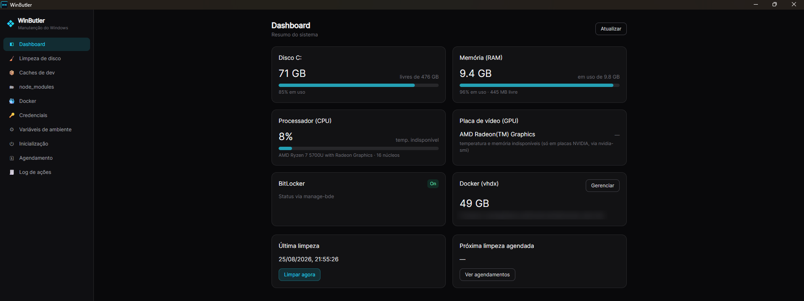

# WinButler

App desktop para **Windows 11** que centraliza rotinas de limpeza e manutenção.
Roda com privilégios de administrador, sem telemetria, dark mode, e nada executa
automaticamente ao abrir — tudo é iniciado pelo usuário.

> Stack: **Tauri v2** (Rust) + **React 18 · Vite 5 · TypeScript · Tailwind 3**.
> O binário nativo (Rust) executa os comandos privilegiados; a UI é web.

<p align="center">
  
</p>

## Funcionalidades

| Seção | O que faz | Comandos por baixo |
|-------|-----------|--------------------|
| **Dashboard** | Espaço em disco, tamanho do vhdx do Docker, status do BitLocker, última/próxima limpeza | `sysinfo`, `manage-bde -status` |
| **Limpeza de disco** | `cleanmgr /sagerun:1`, esvaziar lixeira, espaço recuperado | `cleanmgr`, `Clear-RecycleBin` |
| **Docker** | `system prune`, compactar `ext4.vhdx` (WSL2), tamanho antes/depois, tokens | `docker`, `wsl --shutdown`, `diskpart compact vdisk` |
| **Credenciais** | Listar/remover credenciais do Windows | `cmdkey /list`, `cmdkey /delete` |
| **Variáveis de ambiente** | Listar user/sistema, destacar tokens, remover | `[Environment]::*EnvironmentVariable*` |
| **Inicialização** | Listar e habilitar/desabilitar apps de startup | `Win32_StartupCommand` + `StartupApproved` |
| **Agendamento** | Agendar rotinas (diário/semanal/mensal) + log de execuções | `schtasks`, `Get-ScheduledTask` |
| **Log de ações** | Registro local de tudo (JSONL) | `%LOCALAPPDATA%\WinButler\winbutler.log` |

## Regras de segurança

- Toda ação destrutiva exige **confirmação com explicação** do que será feito.
- **Nada roda ao abrir** — o usuário inicia cada ação.
- Seções se **adaptam ao ambiente**: sem Docker instalado, a seção Docker some.
- **Dry run** em toda ação possível (mostra o que faria sem executar).
- **Sem telemetria**. Log 100% local.

## Pré-requisitos

- **Node ≥ 18** + **Yarn** (frontend).
- **Rust** (stable) — instale em <https://rustup.rs>.
- **Tauri v2** deps de Windows: WebView2 (já vem no Win11) e **Visual Studio Build Tools** (Desktop C++).

## Desenvolvimento

```bash
yarn install

# App completo (abre a janela). Rode a partir de um terminal ELEVADO (admin),
# senão comandos como diskpart/manage-bde falharão.
yarn app:dev

# Só o frontend no browser (sem backend nativo) — útil pra mexer só na UI:
yarn dev        # http://localhost:5173
yarn build      # tsc -b && vite build (verificação de tipos)
```

## Build de produção

```bash
yarn app:build  # gera instalador NSIS em src-tauri/target/release/bundle
```

O manifesto (`src-tauri/windows-app-manifest.xml`) marca o executável como
`requireAdministrator` — o Windows pede elevação (UAC) ao abrir o app instalado.

## Modo headless (Agendador)

O mesmo executável roda rotinas sem UI para as tarefas agendadas:

```
WinButler.exe --run disk_cleanup
WinButler.exe --run empty_recycle_bin
WinButler.exe --run docker_prune
WinButler.exe --run docker_compact
```

As tarefas são criadas sob `\WinButler\<rotina>` no Agendador de Tarefas, com
nível de execução **HIGHEST**.

## Observações

- `cleanmgr /sagerun:1` usa o perfil salvo. Configure uma vez: `cleanmgr /sageset:1`.
- Compactar o vhdx encerra o WSL (`wsl --shutdown`) — **feche o Docker Desktop antes**.
- Os ícones em `src-tauri/icons` (gravata-borboleta ciano) são gerados por
  `src-tauri/gen-icons.ps1`; rode o script pra regerar após mudar o desenho.

## Autor

**Yami Renato** — [@rgvieiraoficial](https://github.com/rgvieiraoficial)
